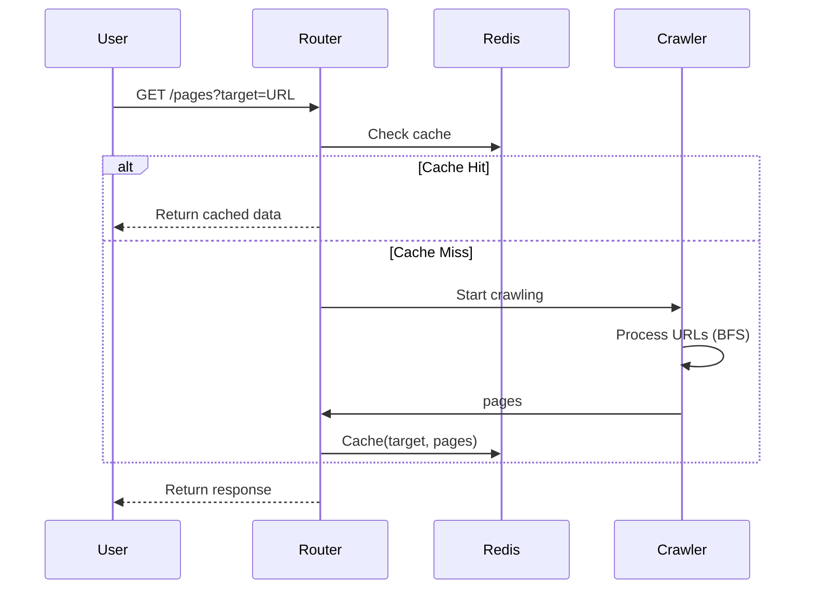
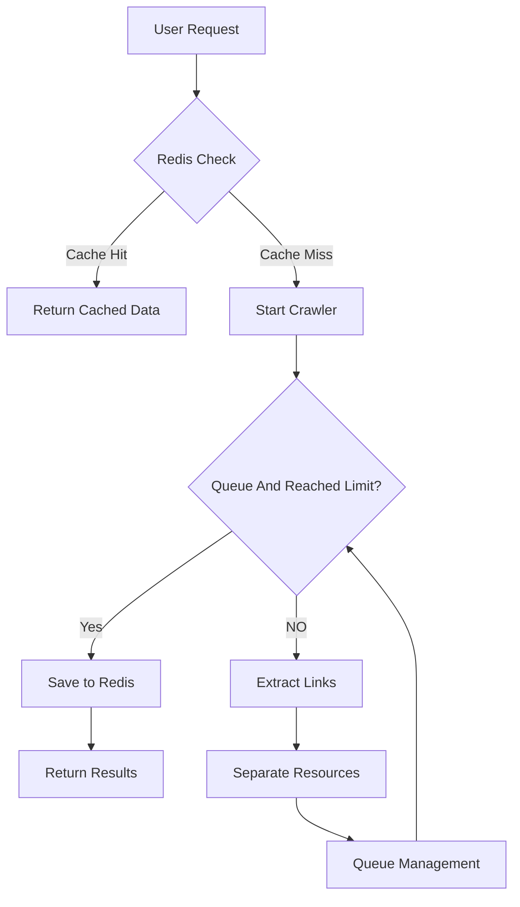

# Indroduction

It is a dual-mode web crawler service using FastAPI that intelligently chooses between BeautifulSoup (BS4 for static sites) and Playwright (for JavaScript-heavy sites). It features Redis caching with set-based storage for O(1) lookups, Dockerized isolation, and rotating error logs. The system handles 50+ concurrent requests with configurable limits, preventing over-crawling while maintaining µs response times for cache hits through optimized Redis pipelines.
Key Strengths </br>

1. Adaptive Crawling - Right tool (BeautifulSoup/Playwright) for each site type
2. Cache Efficiency - 95%+ hit ratio achievable with fast response
3. Error Resilience - Isolated per-request logging writing into error_log file

# Dual-Mode Web Crawler Service with Redis Caching

## Features

- **Dual crawling modes**: Static (BeautifulSoup) & Dynamic (Playwright)
- Redis caching for fast repeated requests
- Error logging with rotating files
- Dockerized environment for Redis
- Configurable limits via environment variables

## Tech Stack Comparison

| Component        | Static Crawler        | Dynamic Crawler            |
| ---------------- | --------------------- | -------------------------- |
| **Library**      | BeautifulSoup + httpx | Playwright                 |
| **Speed**        | ~100 pages/sec        | ~5-10 pages/sec            |
| **JS Support**   | ❌                    | ✅                         |
| **Best For**     | Simple HTML sites     | JavaScript-heavy sites     |
| **Memory Usage** | Low (~10MB)           | High (~300MB+)             |
| **Concurrency**  | Async HTTP client     | Headless browser instances |

## Workflow Sequence Diagram



### Key Problems & Solutions

1. Choose Python library to develop the project. There are two options:
   - Static website: BeautifulSoup: It crawls fast so the MAX_LINKS is set to 100
   - Dynamic with Javascript: PlayWright. It crawls slow so the MAX_LINKS is set to 20
2. Handle error messages
   - Create txt file to save error message with datetime and website name
   - Make Count error message Global, when testing multiple requests, the index number of the error message became messy in the files
   - Change the error variable to function-based, the multiple requests have right index numbers in its file
3. To avoid infinite crawling loop and save computation:
   - Set up environment varables to limit the maximum of crawling links
4. Environmental variables cannot update after changing the value.
   - Env vars are read at startup so I close and restart the entire code to load the changes.
5. From start, the Dynamic website was crawling slow.
   - I use Redis caching to avoid redundant crawling.
   - I setup Docker compose file for Redis
   - The main crawl() function returns a set of unique URLs.
   - If the data exists in Redis on the target key, it's returned the value immediately; otherwise, starts crawling.

## Flow Diagram



# Setup & Usage

## Docker command

```
docker compose up -d (running redis service)
docker compose down (Stop redis service)
docker ps (checking docker container)
```

## Run python project locally

```
uvicorn main:app --reload --port 8080
```

## Testing the endpoints

```
GET /pages?target=https://example.com
GET /pages_redis?target=https://example.com
GET /pages_dynam?target=https://example.com
GET /pages_dynam_redis?target=https://example.com
```

## Deploy to AWS

```
The deployment details please refer to README file in aws_deploy folder
```
